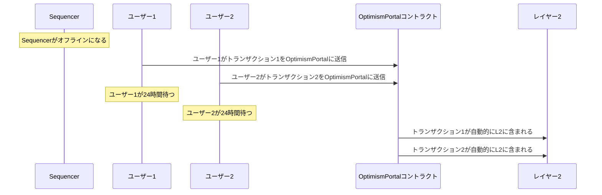
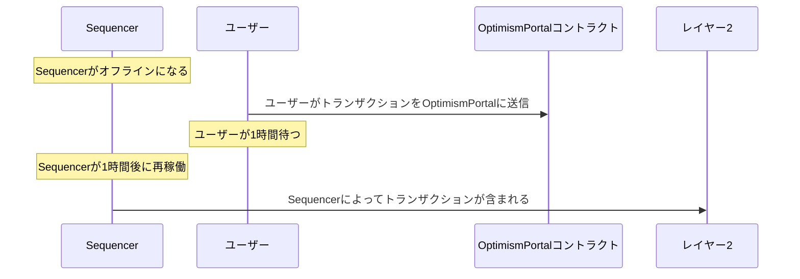
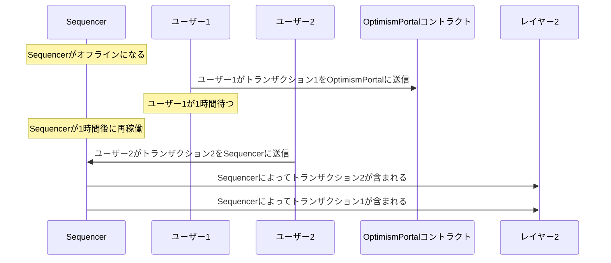

# Sequencerの障害

すべてのOP Stackチェーンには、L2トランザクションを受信、順序付け、およびL1に公開できるSequencerがあります。ソフトウェアシステムである以上、Sequencerはさまざまな理由で利用できなくなる可能性があります。Sequencerの障害の影響と、そのための準備方法を理解することが重要です。

Sequencerの障害は大きく2つのタイプに分類できます：

1.  **Sequencerダウンタイムの障害**は、SequencerがユーザーからのL2トランザクションを完全に受信および/または処理できない場合に発生します。このタイプの障害は、ユーザーにはSequencerにトランザクションを送信できない完全な障害として現れます。
2.  **トランザクション送信の障害**は、SequencerがまだユーザーからのL2トランザクションを受信および処理できるが、これらのトランザクションをL1に公開できない場合に発生します。このタイプの障害は、長期間未解決でない限り、通常ユーザーには影響しません。

両方の障害タイプは、特定の重要な注意点を除いて、L1上の[`OptimismPortal`](https://github.com/ethereum-optimism/optimism/blob/111f3f3a3a2881899662e53e0f1b2f845b188a38/packages/contracts-bedrock/src/L1/OptimismPortal.sol#L209)コントラクトに直接トランザクションを送信することで回避できます。これらの潜在的な障害とその対処方法について、詳しく読み進めてください。

## Sequencerダウンタイムの障害

### 説明

Sequencerダウンタイムの障害は、SequencerがユーザーからのL2トランザクションを受信および/または処理できない場合に発生します。このタイプの障害は、クライアントソフトウェアのバグ、クラウドの障害、その他の類似のエラーなど、さまざまな問題によって引き起こされる可能性があります。Sequencerダウンタイムの障害の正確な原因は、特定のOP StackチェーンのSequencerを実行するために使用されるインフラストラクチャによって異なる場合があります。

### 影響

Sequencerダウンタイムの障害は、ユーザーエクスペリエンスに大きな影響を与える可能性があります。このタイプの障害の間、ユーザーはSequencerに直接トランザクションを送信できなくなります。ユーザーは、ネットワークが特定のブロック高で「停止」しているように見えるかもしれません。

### 対策

ユーザーは常にSequencerをバイパスして、L1上の[`OptimismPortal`](https://github.com/ethereum-optimism/optimism/blob/111f3f3a3a2881899662e53e0f1b2f845b188a38/packages/contracts-bedrock/src/L1/OptimismPortal.sol#L209)コントラクトに直接L2トランザクションを送信することができます。この機能の詳細については、[Sequencerのバイパス](#sequencerのバイパス)セクションを参照してください。

## トランザクション送信の障害

### 説明

トランザクション送信の障害は、SequencerがまだユーザーからのL2トランザクションを受信および処理できるが、これらのトランザクションをL1に公開できない場合に発生します。このタイプの障害は、予期しないL1ネットワークの状況、トランザクション送信ソフトウェアのバグ、その他の類似のエラーなど、さまざまな問題によって引き起こされる可能性があります。

### 影響

トランザクション送信の障害は、長期間未解決でない限り、一般的にユーザーエクスペリエンスに大きな影響を与えません。このタイプの障害の間、ユーザーはSequencerに直接トランザクションを送信できますが、これらのトランザクションを含むブロックはL1に公開されません。ユーザーは、L2チェーンの「セーフ」および「ファイナライズド」ブロック高が停止しているように見え、一方で「アンセーフ」ブロック高は増加し続けることに気付くかもしれません。

トランザクション送信の障害が未解決のままの場合、より重大な影響を及ぼす可能性があります。重要なことに、Sequencerに直接送信されたL2トランザクションは、SequencerによってL2ブロックに含まれてから一定の時間内に公開されなければなりません。この時間制限を超えると、これらのトランザクションを後のブロックに含めるためにL2チェーンを再編成する必要があります。これはユーザーには、L2チェーンの期待される状態が大きく変化したように見える可能性があります。

### 対策

ユーザーは常にSequencerをバイパスして、L1上の[`OptimismPortal`](https://github.com/ethereum-optimism/optimism/blob/111f3f3a3a2881899662e53e0f1b2f845b188a38/packages/contracts-bedrock/src/L1/OptimismPortal.sol#L209)コントラクトに直接L2トランザクションを送信することができます。この機能の詳細については、[Sequencerのバイパス](#sequencerのバイパス)セクションを参照してください。

## Sequencerのバイパス

OP Stackチェーンのコアなセキュリティ目標は、SequencerがユーザーのL2チェーンへのトランザクション送信を妨げることができないようにすることです。OP Stackチェーンのユーザーは常にSequencerをバイパスして、L1上の[`OptimismPortal`](https://github.com/ethereum-optimism/optimism/blob/111f3f3a3a2881899662e53e0f1b2f845b188a38/packages/contracts-bedrock/src/L1/OptimismPortal.sol#L209)コントラクトに直接L2トランザクションを送信することで、L2チェーンにトランザクションを含めることができます。

### OptimismPortalについて

`OptimismPortal`コントラクトは、Sequencerの直接的な関与なしに、スマートコントラクトやEOAがL2トランザクションを作成するために使用できるL1のスマートコントラクトです。多くのユーザーは、すでにすべてのOP Stackチェーンで利用可能なStandard Bridgeシステムを介してL1とL2の間でETHや他のトークンをブリッジするときに、このコントラクトと間接的にやり取りしています。

`OptimismPortal`コントラクトは現在、各OP Stackチェーンごとにユニークなコントラクトです。お使いのOP Stackチェーンのコントラクトアドレスページを参照して、`OptimismPortal`コントラクトのアドレスを見つけてください。L2トランザクションは、`OptimismPortal`コントラクトの`depositTransaction`関数を呼び出すことでL1上でトリガーされます。

### 機能

ユーザーは、コントラクトの作成やETHの価値を運ぶトランザクションを含む、あらゆるタイプのL2トランザクションを`OptimismPortal`コントラクトに送信できます。セキュリティ対策として、`OptimismPortal`を介して送信されたトランザクションは、L2上のスマートコントラクトの観点からは、Sequencerを介して送信されたトランザクションと区別できません。

### アドレスエイリアシング

`OptimismPortal`コントラクトを介してトリガーされたトランザクションは、トランザクションをトリガーしたL1アドレスから送信されたものとして表示されます。ただし、そのトランザクションがスマートコントラクトによって送信された場合は除きます。スマートコントラクトによって`OptimismPortal`コントラクトを介して送信されたL2トランザクションは、スマートコントラクトの「エイリアス化」されたアドレスから送信されたものとして表示されます。アドレスエイリアシングの詳細については、[アドレスエイリアシング](/chain/differences#address-aliasing)の解説を参照してください。

### 包含ルール

`OptimismPortal`コントラクトに送信されたトランザクションは、失敗したSequencerの影響を制限するように設計された一連のルールに従って処理されます。障害の影響を適切に軽減するためには、これらのルールを詳細に理解することが重要です。

`OptimismPortal`に送信されたすべてのトランザクションについて：

1.  トランザクションは、特定のL1ブロック内で送信されたものが一緒に処理されます。
2.  トランザクションには、[`max_sequencer_drift`](https://specs.optimism.io/protocol/derivation.html#overview)を超えない将来のタイムスタンプが与えられます。
3.  トランザクションは、受信された順序で処理されます。
4.  トランザクションは、[`sequencer_window`](https://specs.optimism.io/glossary.html#sequencing-window)内で処理されます。

実際には、`OptimismPortal`コントラクトに送信されたトランザクションは、受信された順序で常に処理され、`sequencer_window`の最大遅延内（デフォルトでは24時間に設定されていますが、チェーンによって異なる場合があります）で処理されます。Sequencerが利用できないか、トランザクションがこの`sequencer_window`内にL1に公開されない場合、OP StackチェーンはこれらのトランザクションがL2チェーンに含まれることを保証するために自動的に再編成されます。

`OptimismPortal`コントラクトに送信されたトランザクションがどのように処理されるかについて、より詳細な説明は[L2チェーンの導出仕様](https://specs.optimism.io/protocol/derivation.html)を参照してください。

### 包含シナリオ

`OptimismPortal`コントラクトに送信されたトランザクションがさまざまなシナリオでどのように処理されるかを理解することは有益です。以下のシナリオは、`OptimismPortal`コントラクトに送信されたトランザクションがどのように処理されるかを説明するために、SequencerとL2チェーンの状態に関する異なる仮定をしています。

#### 完全なSequencerの障害

このシナリオでは、Sequencerが完全に利用できず、トランザクションを処理できないと仮定します。ユーザーは、`OptimismPortal`コントラクトに直接トランザクションを送信して、L2チェーンに含める必要があります。また、`sequencer_window`が24時間に設定されていると仮定します。ここでは、2人のユーザーが`OptimismPortal`コントラクトにトランザクションを送信しています。

両方のユーザーが送信したトランザクションが、`sequencer_window`が経過した後に自動的にL2チェーンに含まれることに注目してください。トランザクションは、`OptimismPortal`コントラクトで受信された順序でL2チェーンに含まれます。

#### 部分的なSequencerの障害

このシナリオでは、Sequencerが一時的にダウンしているが、`sequencer_window`が経過する前に再稼働するものとします。ユーザーがダウンタイム中に`OptimismPortal`にトランザクションを送信し、Sequencerが再稼働して、完全な`sequencer_window`が終了する前にトランザクションをL2ブロックに含めます。

#### 部分的な障害の順序付け

ここでも、Sequencerが一時的にダウンしているが、`sequencer_window`が経過する前に再稼働するものとします。このシナリオでは、Sequencerが`OptimismPortal`コントラクトに送信されたトランザクションの間に追加のトランザクションをL2チェーンに含める能力を観察します。

ここでは、最初のユーザーが`OptimismPortal`コントラクトにトランザクションを送信した後に、2番目のユーザーがSequencerにトランザクションを送信したにもかかわらず、Sequencerは2番目のユーザーのトランザクションを最初のユーザーのトランザクションより先に含めることができます。**Sequencerは通常、`OptimismPortal`コントラクトに送信されたトランザクションを他のトランザクションよりも先に含めることを選択しますが、これは保証されていません。**

